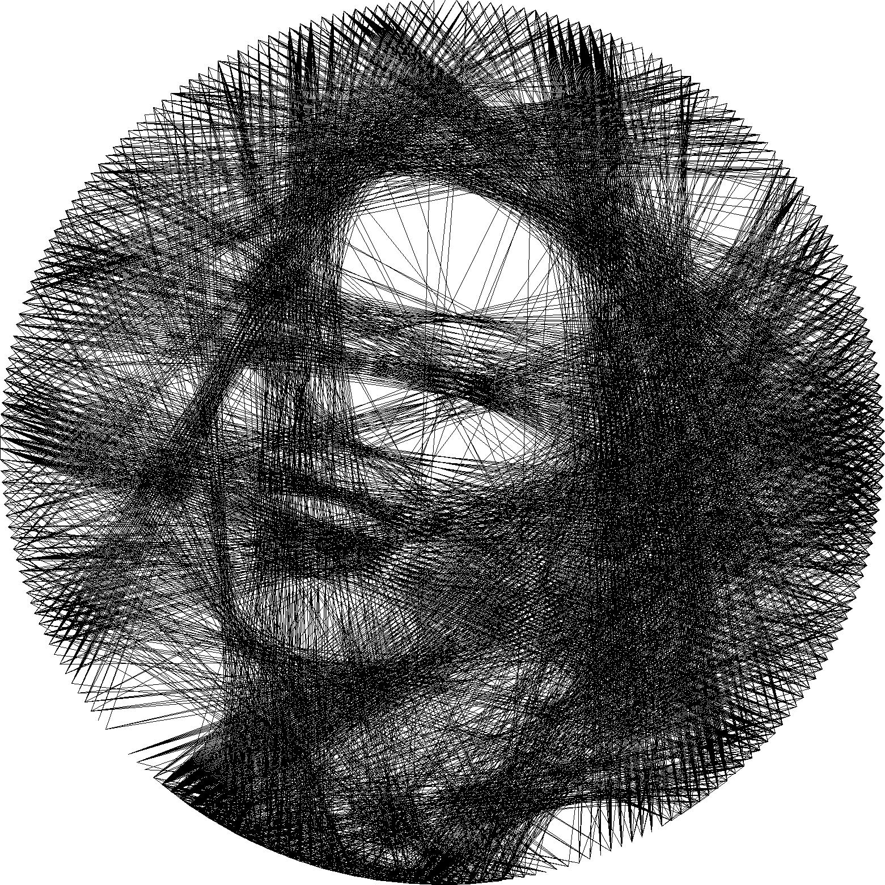

# Art Threader
Automatic generation of Thread Art images. Master Thesis (2022)

# Dependence
- Use only Python 3.9 (not tested if works with other versions)
- Install dependencies from requirement.txt 
- Put those files in ~/.u2net: https://github.com/danielgatis/rembg#models (as instructed)

# How to run
- Follow art-threader.ipynb Jupyter Notebook 
